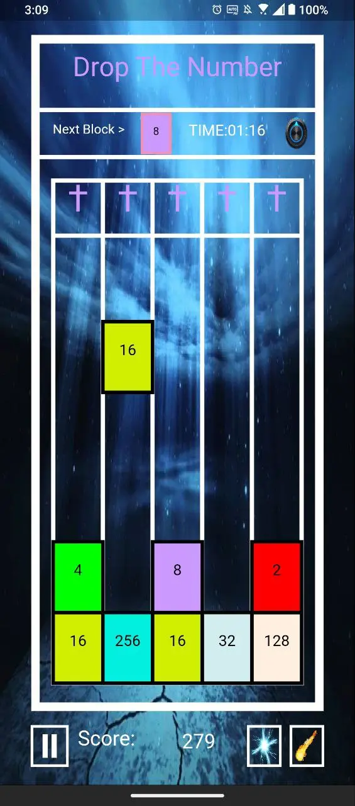

# dropthenumber

A minigame written in flutter.



## Supported Platforms

- [x] web
- [x] Android APK
- [x] Android AAB
- [x] Android Google Play
- [x] iOS 3rd party software

## Game features

1. The mute buttons appear on the main screen and on the game play screen
2. The volume adjustment buttons appear on the main screen
3. Pause button
4. Horiznotal superpower (can be use every 2 minutes) every time you enable this function, the last square of each row will be remove
5. Vertical superpower (can be use every 2 minutes) every time you enable this function, all the squares in the highest track will be remove
6. Reset button after the game is over, reset the layout, time, and automatically start playing
7. The Quit buttons appear on the main screen and when the game is over, click to exit the game
8. The back to main screen button appears in the lower left corner when the game is over 

## How to run

1. Generate upload-keystore.jks for application signature. [(flutter document)](https://flutter.dev/docs/deployment/android#create-an-upload-keystore)

    In Linux or Mac:

    ```
    keytool -genkey -v -keystore ~/upload-keystore.jks -keyalg RSA -keysize 2048 -validity 10000 -alias upload
    ```

    In Windows:

    ```
    keytool -genkey -v -keystore %userprofile%\upload-keystore.jks -storetype JKS -keyalg RSA -keysize 2048 -validity 10000 -alias upload
    ```

2. Update the path to your signature file.

    Update the `storeFile=/home/<USER_NAME>/upload-keystore.jks` in "android/key.properties"

3. Run now! For more information please check [flutter document](https://flutter.dev/docs/reference/flutter-cli).

    ```
    flutter run
    ```

4. Build AAB file

    ```
    flutter build appbundle
    ```
